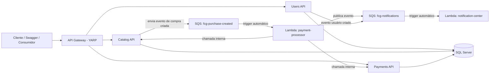

# FCG Fase 3

Projeto da **FIAP Cloud Games (FCG)** para a Fase 3, com foco em **microsserviços**, **serverless**, **API Gateway**, **audit log**, **observabilidade** e **CI/CD**.

## Objetivo do projeto

Esta solução evolui o sistema anterior para uma arquitetura distribuída com:
- **3 microsserviços principais**:
  - `users-api_fase3`
  - `catalog-api_fase3`
  - `payments-api_fase3`
- **API Gateway** implementado com **YARP em ASP.NET Core**
- **2 Lambdas AWS** para processamento assíncrono:
  - `notification-center`
  - `payment-processor`
- **Audit log** para rastreabilidade de mudanças
- **Observabilidade** com **Datadog**, logs estruturados e traces
- **CI/CD** com **GitHub Actions**
- **Containerização** com **Docker** e **docker-compose**

> Neste projeto, o requisito de API Gateway foi atendido com um gateway próprio em .NET usando **YARP**, em vez do serviço gerenciado da AWS.

---

## Estrutura do repositório

```text
FCG-fase3/
├── .github/
│   └── workflows/
│       └── cicd-aws.yml
├── GatewayAPI/
│   ├── GatewayAPI.sln
│   ├── README.md
│   └── GatewayAPI/
├── users-api_fase3/
│   ├── FCGUsersAPI.sln
│   ├── README.md
│   └── UsersAPI/
├── catalog-api_fase3/
│   ├── FCGCatalogAPI.sln
│   ├── README.md
│   └── CatalogAPI/
├── payments-api_fase3/
│   ├── FCGPaymentsAPI.sln
│   ├── README.md
│   └── PaymentsAPI/
├── lambdas/
│   ├── notification-center/
│   └── payment-processor/
└── observability/
    ├── docker-compose.yml
    └── docker-compose.aws.yml
```

---

## Componentes da arquitetura

### 1. Users API
Responsável por:
- cadastro de usuários
- autenticação via JWT
- autorização
- publicação de eventos em SQS quando necessário
- auditoria de ações

Pasta: `users-api_fase3`

### 2. Catalog API
Responsável por:
- catálogo de jogos/produtos
- consulta e compra
- integração com fluxo assíncrono de compra
- atualização de status da compra

Pasta: `catalog-api_fase3`

### 3. Payments API
Responsável por:
- processamento de pagamentos
- registro de transações
- retorno de status do pagamento
- integração com fluxo distribuído

Pasta: `payments-api_fase3`

### 4. API Gateway com YARP
Responsável por:
- centralizar entrada das requisições
- rotear chamadas para os microsserviços
- expor URLs únicas para acesso externo
- simplificar consumo dos serviços na EC2

Pasta: `GatewayAPI`

Rotas configuradas:
- `/users/*` -> `users-api`
- `/games/*` -> `catalog-api`
- `/payments/*` -> `payments-api`

### 5. Lambda `notification-center`
Responsável por:
- consumir mensagens da fila `fcg-notifications`
- processar eventos assíncronos
- simular envio de notificações via log

Pasta: `lambdas/notification-center`

### 6. Lambda `payment-processor`
Responsável por:
- consumir mensagens da fila `fcg-purchase-created`
- processar pagamento de forma assíncrona
- chamar internamente o `PaymentsAPI`
- atualizar o `CatalogAPI`
- publicar evento na fila `fcg-notifications`

Pasta: `lambdas/payment-processor`

### 7. Observabilidade
Responsável por:
- subir SQL Server, Datadog Agent e containers da aplicação
- padronizar execução local e em cloud via Docker Compose

Pasta: `observability`

---

## Fluxo de comunicação dos microsserviços

### Fluxo principal de compra

1. O cliente chama o **API Gateway**.
2. O Gateway encaminha para o microsserviço correto.
3. No fluxo de compra, o **Catalog API** registra a intenção de compra.
4. O **Catalog API** publica um evento na fila **`fcg-purchase-created`**.
5. A Lambda **`payment-processor`** é acionada automaticamente por trigger SQS.
6. A Lambda chama o **Payments API** para processar o pagamento.
7. A Lambda chama o **Catalog API** para atualizar o resultado do pagamento.
8. A Lambda publica um evento na fila **`fcg-notifications`**.
9. A Lambda **`notification-center`** é acionada automaticamente por trigger SQS.
10. A notificação é registrada em log no CloudWatch.

### Fluxo resumido em diagrama



---

## URLs publicadas na AWS

### Microsserviços diretamente
- Users API: `http://3.139.59.8:5001/swagger/index.html`
- Catalog API: `http://3.139.59.8:5002/swagger/index.html`
- Payments API: `http://3.139.59.8:5003/swagger/index.html`

### API Gateway
- Users: `http://3.139.59.8:5000/users/swagger/index.html`
- Games/Catalog: `http://3.139.59.8:5000/games/swagger/index.html`
- Payments: `http://3.139.59.8:5000/payments/swagger/index.html`

> Internamente, o gateway usa nomes de host Docker:
> - `users-api`
> - `catalog-api`
> - `payments-api`

---

## Pré-requisitos

Para trabalhar localmente e também preparar o deploy:

- .NET SDK 8
- Docker
- Docker Compose
- AWS CLI
- Git
- acesso a uma conta AWS
- acesso ao Datadog
- permissões para criar:
  - SQS
  - Lambda
  - IAM Role/Policy
  - ECR
  - EC2

---

## O que configurar após clonar o projeto

Depois do clone, revise os seguintes pontos.

### 1. Variáveis do `observability/.env`
O `docker-compose.aws.yml` depende de variáveis externas. Crie ou ajuste o arquivo `.env` em `observability/` com valores reais para:

```env
SQL_SA_PASSWORD=
DD_API_KEY=
DD_SITE=
JWT_ISSUER=
JWT_KEY=
INTERNAL_API_KEY=
AWS_REGION=
NOTIFICATIONS_QUEUE_URL=
PURCHASE_CREATED_QUEUE_URL=
ADMIN_NAME=
ADMIN_EMAIL=
ADMIN_PASSWORD=
USERS_API_IMAGE=
CATALOG_API_IMAGE=
PAYMENTS_API_IMAGE=
GATEWAY_API_IMAGE=
```

#### Significado das variáveis
- `SQL_SA_PASSWORD`: senha do SQL Server
- `DD_API_KEY`: chave do Datadog
- `DD_SITE`: site do Datadog, por exemplo `datadoghq.com`
- `JWT_ISSUER`: emissor do token JWT
- `JWT_KEY`: chave do JWT compartilhada pelos serviços
- `INTERNAL_API_KEY`: chave usada no header `x-internal-api-key`
- `AWS_REGION`: região AWS usada por filas e lambdas
- `NOTIFICATIONS_QUEUE_URL`: URL da fila `fcg-notifications`
- `PURCHASE_CREATED_QUEUE_URL`: URL da fila `fcg-purchase-created`
- `ADMIN_NAME`, `ADMIN_EMAIL`, `ADMIN_PASSWORD`: usuário administrador inicial
- `*_IMAGE`: imagens publicadas no ECR para o ambiente AWS/EC2

### 2. `appsettings.json`
Os projetos trazem valores de desenvolvimento e placeholders. Revise:
- `UsersAPI/appsettings.json`
- `CatalogAPI/appsettings.json`
- `PaymentsAPI/appsettings.json`
- `GatewayAPI/appsettings.json`

Troque ou sobrescreva por variável de ambiente principalmente:
- connection strings
- JWT
- internal api key
- URLs de filas SQS

> Em produção, prefira **variáveis de ambiente** e não segredos fixos em arquivo.

### 3. URLs internas para a Lambda `payment-processor`
Na AWS, a Lambda precisa receber por variável de ambiente:

- `PAYMENTS_API_BASE_URL`
- `CATALOG_API_BASE_URL`
- `INTERNAL_API_KEY`
- `NOTIFICATIONS_QUEUE_URL`
- `AWS_REGION`

Essas URLs devem apontar para os endpoints internos usados pela Lambda.

### 4. GitHub Secrets para CI/CD
O workflow `.github/workflows/cicd-aws.yml` depende de secrets no GitHub. Configure no repositório:

```text
AWS_ACCESS_KEY_ID
AWS_SECRET_ACCESS_KEY
AWS_REGION
```

Também revise se o workflow precisa de secrets adicionais conforme sua estratégia de deploy.

---

## Como rodar localmente

### Opção 1. Subir tudo com Docker Compose local
Na pasta `observability`:

```bash
docker compose up --build
```

Esse arquivo usa o `docker-compose.yml` local, com build a partir dos projetos.

### Opção 2. Rodar projetos individualmente
Você também pode abrir cada solução e executar separadamente:
- `users-api_fase3/FCGUsersAPI.sln`
- `catalog-api_fase3/FCGCatalogAPI.sln`
- `payments-api_fase3/FCGPaymentsAPI.sln`
- `GatewayAPI/GatewayAPI.sln`

---

## Como subir na AWS/EC2

### 1. Publicar imagens no ECR
O pipeline `cicd-aws.yml` já contempla build, testes e push das imagens. Os repositórios utilizados no workflow são:

- `fcg-users-api`
- `fcg-catalog-api`
- `fcg-payments-api`
- `fcg-gateway-api`

### 2. Atualizar `observability/.env` na EC2
Na EC2, configure:
- nomes completos das imagens do ECR
- filas SQS reais
- chave JWT
- Datadog
- senha do SQL Server
- chave interna entre serviços

### 3. Subir os containers na EC2
Na pasta `observability`:

```bash
docker compose -f docker-compose.aws.yml up -d
```

Esse arquivo sobe:
- `sqlserver`
- `datadog-agent`
- `gateway-api`
- `users-api`
- `catalog-api`
- `payments-api`

---

## Segurança entre os microsserviços

O projeto usa mais de um mecanismo de proteção:

### Acesso externo
- o acesso principal é feito via **API Gateway**
- endpoints públicos podem usar **JWT**

### Acesso interno
- integrações internas usam o header:
  - `x-internal-api-key`

### Observações
- a chave interna precisa ser igual entre quem chama e quem recebe
- a Lambda `payment-processor` também precisa enviar essa chave nas chamadas para `CatalogAPI` e `PaymentsAPI`

---

## Observabilidade e rastreamento

A solução inclui:
- **Serilog** para logs estruturados
- **Datadog Agent** para coleta
- **DD_TRACE** habilitado nos containers
- **Correlation ID** para rastreabilidade ponta a ponta

No `docker-compose.aws.yml`, os serviços já recebem variáveis como:
- `DD_AGENT_HOST`
- `DD_TRACE_AGENT_PORT`
- `DD_TRACE_ENABLED`
- `DD_LOGS_INJECTION`
- `DD_ENV`
- `DD_SERVICE`
- `DD_VERSION`

---

## Audit log / rastreabilidade de mudanças

O desafio pede event sourcing ou equivalente, como temporal tables, audit logs ou mecanismo semelhante.

Nesta solução, esse requisito é atendido por **audit log**, registrando mudanças relevantes no estado do sistema.

Para apresentação, destaque:
- criação e alteração de entidades
- logs de ações sensíveis
- correlação entre requisição, serviço e operação

---

## Lambdas e filas SQS

### `notification-center`
- fila de entrada: `fcg-notifications`
- trigger automático: SQS -> Lambda
- saída: logs no CloudWatch

### `payment-processor`
- fila de entrada: `fcg-purchase-created`
- trigger automático: SQS -> Lambda
- chamadas internas:
  - `PaymentsAPI`
  - `CatalogAPI`
- fila de saída:
  - `fcg-notifications`

---

## Como publicar as Lambdas

### Notification Center
A lambda `notification-center` usa `template.yaml` com:
- criação da fila `fcg-notifications`
- função `fcg-notification-center`
- evento SQS configurado no próprio template

### Payment Processor
A lambda `payment-processor` usa `template.yaml` com:
- criação da fila `fcg-purchase-created`
- função `fcg-payment-processor`
- trigger SQS configurado no template
- permissão para enviar mensagens à fila `fcg-notifications`

### Fluxo recomendado de publicação
1. publicar `notification-center`
2. obter:
   - `NotificationQueueUrl`
   - `NotificationQueueArn`
3. publicar `payment-processor` informando esses valores como parâmetros
4. validar trigger automático das duas lambdas

> Como o desafio permite CLI, CloudFormation, SAM ou equivalente, esta abordagem atende ao requisito.

---

## Exemplo de deploy com SAM

### Notification Center
Na pasta `lambdas/notification-center`:

```bash
sam build
sam deploy --guided
```

### Payment Processor
Na pasta `lambdas/payment-processor`:

```bash
sam build
sam deploy --guided
```

Na publicação da `payment-processor`, informe:
- `PaymentsApiBaseUrl`
- `CatalogApiBaseUrl`
- `InternalApiKey`
- `AwsRegion`
- `NotificationsQueueUrl`
- `NotificationsQueueArn`

---

## Testes

### Microsserviços
Execute em cada solução:

```bash
dotnet test
```

### Lambdas
Execute dentro da pasta da lambda correspondente:

```bash
dotnet test
```

---

## CI/CD

Arquivo principal:
- `.github/workflows/cicd-aws.yml`

O workflow realiza:
- checkout
- setup do .NET 8
- restore
- build
- testes
- login na AWS
- login no ECR
- garantia de criação dos repositórios ECR
- build e push das imagens

---

## Observação final

Este README foi preparado com base na estrutura atual do projeto, nos arquivos presentes no repositório e na arquitetura atual informada, considerando:
- API Gateway com YARP em .NET
- `docker-compose.aws.yml` como orquestração da EC2
- Lambdas publicadas via AWS CLI/SAM
- uso de Datadog, audit log, CI/CD e SQS no fluxo assíncrono
